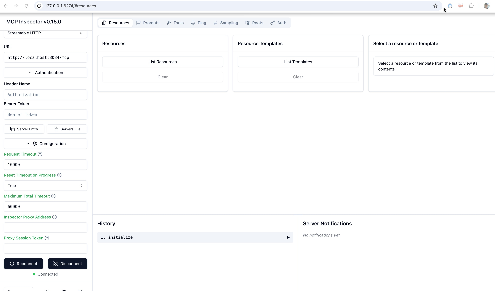
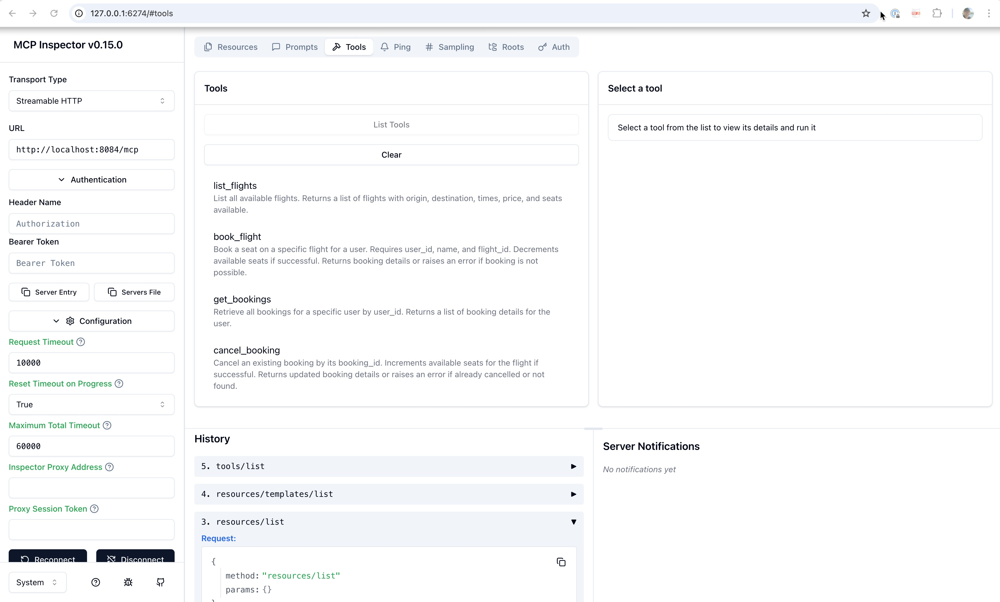

# 3. Connect to the MCP server with MCP inspector

### Step 1: Install and start the [MCP Inspector](https://github.com/modelcontextprotocol/inspector)

   ```sh
   export DANGEROUSLY_OMIT_AUTH=true   
   npx @modelcontextprotocol/inspector  
   ```

### Step 2: Open the `MCP inspector` in the browser

   ```sh
   open http://localhost:6274
   ```

### Step 2: Use the `MCP inspector`:

* Open the

* Connect
  * Transport Type: Streamable HTTP
  * Url: `http://localhost:8084/mcp`

  

* List the available tools

  


### Step 2: Start the "lite chat"

```sh
cd watsonx-orchestrate-adk
orchestrate chat start
orchestrate server logs
```

### [Home](https://github.com/IBM/oic-i-agentic-ai-tutorials/blob/main/end-to-end-agent-use-case-implementation-with-galaxium-travels-full-local-setup-guide-and-mcp/README.md)