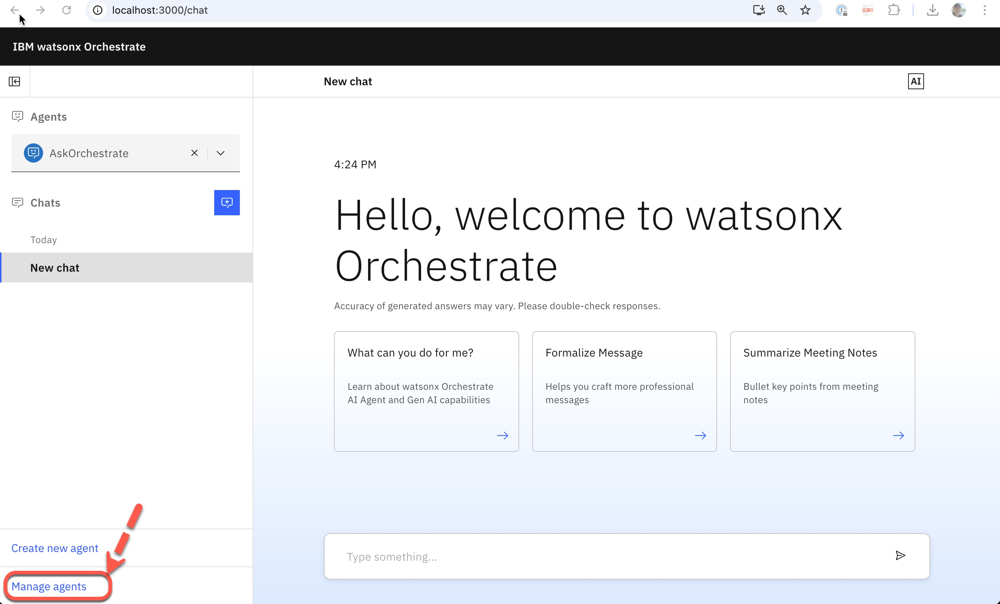
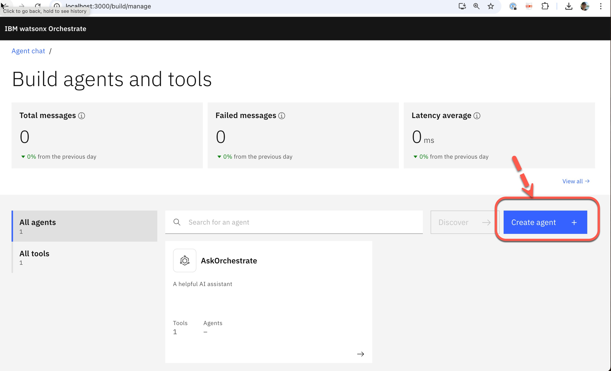
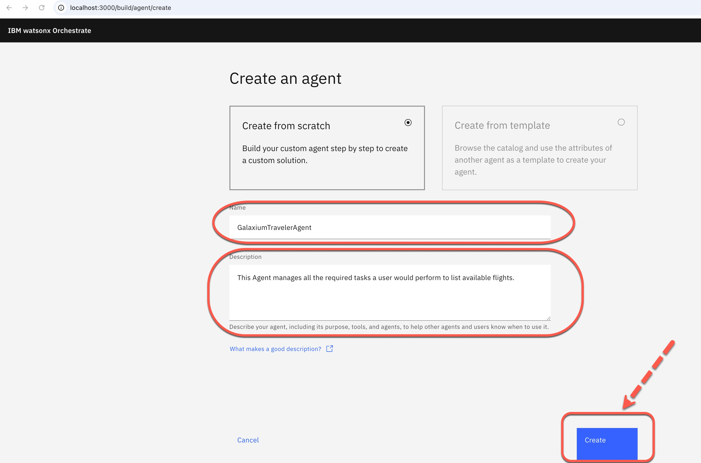
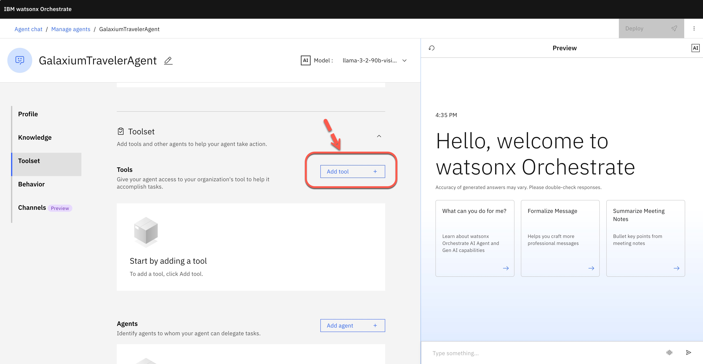
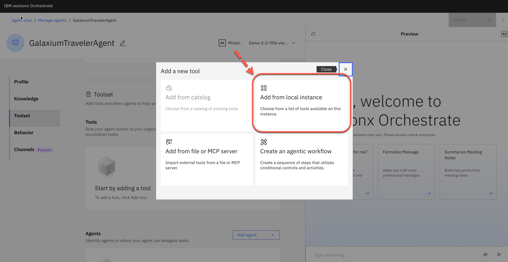
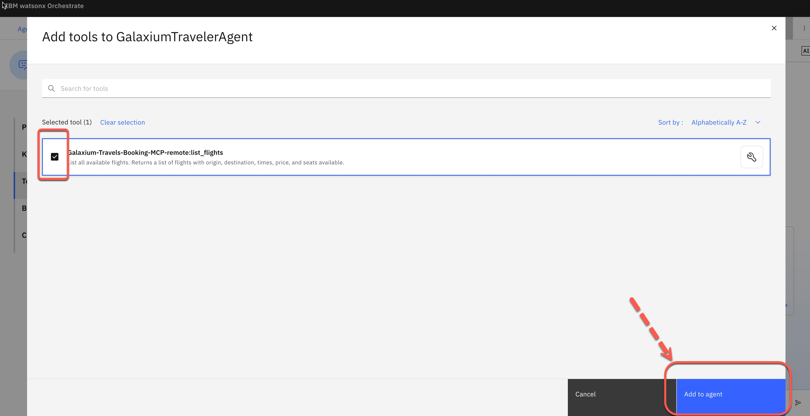

# Create a new Agent and test the MCP Tool

Ensure the local watsonx Orchestrate Lite chat is available.

>We will create a simple agent without any additional behavior instructions.
The basic agent will be able to invoke the tool without any additional prompting.

### Step 1: Press `Manage agents`

### Step 2: Press `Create agent`

### Step 3: Give the agent a name, a short description, and press `Create`

* Name: `GalaxiumTravelerAgent`
* Description: `This Agent manages all the required tasks a user would perform to list available flights.`

### Step 4: Navigate to the Toolset and press `Add tool`

### Step 5: In the new window, select `Add from local instance`

The `tool from the remote MCP server` is now available from our current watsonx Orchestrate instance.

### Step 6: Select the tool `Galaxium-Travels-Bookin-MCP-remote:list_flights`

The name reflects that we are using the `list_flights` tool from the remote MCP server called `Galaxium-Travels-Booking-MCP-remote`.

### Step 7: Ask the following question

Question: `Can you show me the available flights?`

### (Optional) Step 8: Access Langfuse and inspect the agent/tool trace

* URL: http://localhost:3010/
* Username: `orchestrate@ibm.com`
* Password: `orchestrate`

### [Home](https://github.com/thomassuedbroecker/galaxium-travels-mcp-compose-watsonx-orchestrate?tab=readme-ov-file)