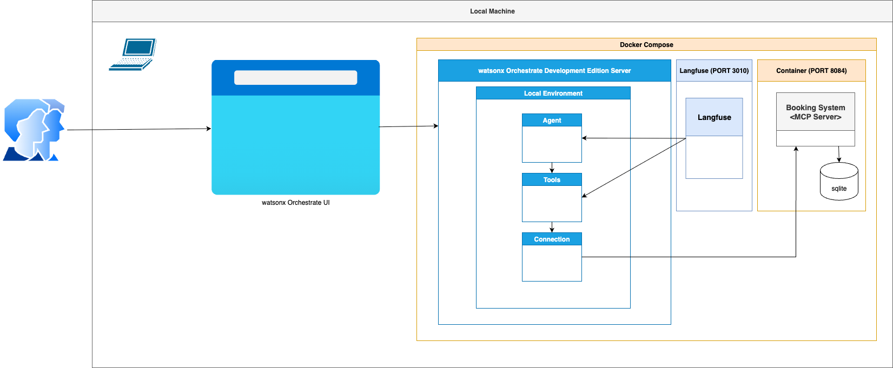

# End-to-End Agent Use Case Implementation with Galaxium Travels: Full Local Setup Guide and MCP 

_Galaxium Travels local MCP Server, `watsonx Orchestrate Development Edition`, and `Docker-Compose`_

Table of Content

1. Blog post on IBM Developer
2. Disclamer
3. Related YouTube video
4. Repository content overview
5. The example application
6. Run the example

## 1. Blog post on IBM Developer
>!!! **IBM Developer** _[**Set up an end-to-end use case for local AI agents with MCP server and watsonx Orchestrate**](https://developer.ibm.com/tutorials/local-ai-agent-workflow-mcp-watsonx-orchestrate/)_ !!!

## 2. Disclamer
>**Custom Docker-Compose** in watsonx Orchestrate is NOT official supported: https://developer.watson-orchestrate.ibm.com/developer_edition/custom_yaml

---

>**Important Note**: _Before starting watsonx Orchestrate Developer Edition with a custom Docker Compose file, make sure you understand every change in your configuration. The ADK doesn’t offers official support to custom Compose setups, so you’re responsible for troubleshooting any issues that arise._

## 3. Related YouTube video
`Galaxium + MCP + watsonx Orchestrate: Full Local Setup Guide (until watsonx Orchestrate version 1.x)`

[](https://www.youtube.com/watch?v=LRIAkzVrIvc?si=G3rUkmkwmvBD_yuV)

## 4. Repository content overview

### 4.1 Basic Architecture

This repository demonstrates how to set up a `MCP server` locally and integrate it into the `watsonx Orchestrate Development Edition` using `Docker-Compose`.

* **MCP Server:** The image below shows simplified dependencies of the entire setup, including:
    * Docker Compose
    * `watsonx Orchestrate Development Edition Server`
         * Agent
         * Tools
         * Connection
    * Langfuse
    * MCP server

* watsonx Orchestrate ADK 1.x



* watsonx Orchestrate ADK 2.0 - 2.1


## 5. The example application

This repository contains resources for the "galaxium_travels_mcp-compose-watsonx-orchestrate" project, utilizing the `watsonx Orchestrate Development Edition`.

* Galaxium Travels Applications:
    * Galaxium Travels Booking MCP: http://localhost:8084/mcp
    * Galaxium Travels WebApp: http://localhost:8083
    * Galaxium Travels Booking: http://localhost:8082/docs
    * Galaxium Travels HR: http://localhost:8081/docs

* watsonx Orchestrate 
    * Langfuse: http://localhost:3010
    * watsonx Orchestrate LiteChat: http://localhost:3000

* Related resources:

    * [YouTube video: Galaxium + MCP + watsonx Orchestrate: Full Local Setup Guide](https://www.youtube.com/watch?v=LRIAkzVrIvc) to the following steps.

## 6. Run the example

Be aware that there are two versions to run the example with watsonx Orchestrate Development Edition in ADK: Version 1.x and 2.0/2.1. 

follow the steps

* Version 1.x :
    3 Set up the watsonx Orchestrate ADK and watsonx Orchestrate Development Server
    5 Connect to MCP Gateway and MCP server
* Version 2.0-2.1 :
    3.1 Set up the watsonx Orchestrate ADK and watsonx Orchestrate Development Server
    5.1 Connect to MCP Gateway and MCP server

#### 0. Clone this repository to your local machine

This is to ensure you use the same folder structure as defined in the following documentation.

```sh
git clone https://github.com/thomassuedbroecker/galaxium-travels-mcp-compose-watsonx-orchestrate.git
cd galaxium-travels-mcp-compose-watsonx-orchestrate
```

* Inspect the folder structure:

```sh
tree .
.
├── 1-galaxium_setup.md
├── 2-watsonx_adk_setup.md
├── 2-1-watsonx_adk_setup.md
├── 3-connect-to-the-mcp-server-with-mcp-inspector.md
├── 4-connect-to-the-mcp-server.md
├── 4-1-connect-to-the-mcp-server.md
├── 5-create-an-agent-and-test-the-mcp-tool.md
├── example-application-infrastructure
│   └── README.md
├── export_import
├── images
│   ├── connect-to-mcp-locally-01.jpg
│   ├── connect-to-mcp-locally-02.jpg
│   ├── connect-to-mcp-locally-03.jpg
│   ├── ...
│   └── mcp-server-overview-01.png
├── LICENSE
├── README.md
└── watsonx-orchestrate-adk
    └── README.md
    ├── setup_mcp_server_inside_watsonx_orchestrate_development_edition.sh
    ├── start_custom_compose_orchestrate_watsonx_orchestrate_development_edition.sh
    └── start_export_compose_orchestrate_watsonx_orchestrate_development_edition_sh
```

#### 1. Start your container engine

Ensure your container engine is running on your desktop.
[Configuring container manager](https://developer.watson-orchestrate.ibm.com/developer_edition/wxOde_setup#configuring-container-manager)

_Additional information:_

* Docker Desktop (tested only on Mac OS):
    - Kubernetes must be enabled, Settings -> Kubernetes -> Enable Kubernetes, leave the rest by default (kubeadm is sufficient)
    - Start Docker Desktop neurally
    - Enter the `.kube` directory from your home directory under `Settings -> Resources -> File sharing` (i.e. /Users/<username>/.kube)

#### 2. [Set up the example `Galaxium Travels Infrastructure`](https://github.com/thomassuedbroecker/galaxium-travels-mcp-compose-watsonx-orchestrate/blob/main/1-galaxium_setup.md)

#### 3. [Set up the watsonx Orchestrate ADK and watsonx Orchestrate Development Server](https://github.com/thomassuedbroecker/galaxium-travels-mcp-compose-watsonx-orchestrate/blob/main/end-to-end-agent-use-case-implementation-with-galaxium-travels-full-local-setup-guide-and-mcp/2-watsonx_adk_setup.md)

#### 3.1 [(Version 2.0 -2.1) Set up the watsonx Orchestrate ADK and watsonx Orchestrate Development Server](https://github.com/thomassuedbroecker/galaxium-travels-mcp-compose-watsonx-orchestrate/blob/main/2-1-watsonx_adk_setup.md)

#### 4. [Connect to the MCP server with MCP inspector](https://github.com/thomassuedbroecker/galaxium-travels-mcp-compose-watsonx-orchestrate/blob/main/3-connect-to-the-mcp-server-with-mcp-inspector.md)

#### 5. [(Version 2.0 -2.1) Connect to MCP Gateway and MCP server](https://github.com/thomassuedbroecker/galaxium-travels-mcp-compose-watsonx-orchestrate/blob/main/3-connect-to-the-mcp-server-with-mcp-inspector.md) 

#### 5.1 [Connect to MCP Gateway and MCP server](https://github.com/thomassuedbroecker/galaxium-travels-mcp-compose-watsonx-orchestrate/blob/main/4-connect-to-the-mcp-server.md) 

#### 6. [Create a new Agent and test the MCP Tool](https://github.com/thomassuedbroecker/galaxium-travels-mcp-compose-watsonx-orchestrate/blob/main/5-create-an-agent-and-test-the-mcp-tool.md) 

#### 7. Additional resources

* **The Galaxium Travels Examples**   
    * [Galaxium Travels Infrastructure](https://github.com/thomassuedbroecker/galaxium-travels-infrastructure)
    * [Galaxium Travels Idea](https://github.com/Max-Jesch/galaxium-travels)
    * [Galaxium Travels Embedded Webchat Example](https://github.com/thomassuedbroecker/galaxium_travels_embedded_webchat_example)
    * [Galaxium Travels Evaluation Example](https://github.com/thomassuedbroecker/galaxium_travels_evaluation_example)
    * [Galaxim Travels Knowledge Graph RAG example](https://github.com/thomassuedbroecker/galaxium-travels-graph-rag-watsonx-ai-example)


* **Blog posts**

    * [Integrating watsonx Orchestrate Agent Chat in Web Apps](https://suedbroecker.net/2025/08/08/integrating-watsonx-orchestrate-agent-chat-in-web-apps/)
    * [Getting Started with Local AI Agents in the watsonx Orchestrate Development Edition](https://suedbroecker.net/2025/06/25/getting-started-with-local-ai-agents-in-the-watsonx-orchestrate-developer-edition/)
    * [`Building Agentic AI solutions with WatsonX Orchestrate and Remote MCP Servers: A Weather Tool Example`](https://medium.com/@rishraj.2000/building-agentic-ai-solutions-with-watsonx-orchestrate-and-remote-mcp-servers-a-weather-tool-4dc795de76bb)
    * [Converting SSE to STDIO via the MCP Gateway](https://heidloff.net/article/mcp-gateway/)

* **ADK documentation**
    * [Importing remote MCP toolkits](https://developer.watson-orchestrate.ibm.com/tools/toolkits/remote_mcp_toolkits#using-streamable-http)
    * [IBM watsonx Orchestrate Agent Development Kit](https://developer.watson-orchestrate.ibm.com/)

* **MCP documentation**
    * [Transports](https://modelcontextprotocol.io/specification/2025-06-18/basic/transports)
